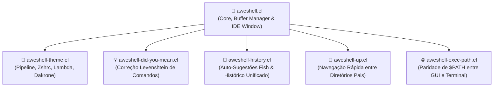

# 🐚 Aweshell — Awesome Eshell

> Extensão avançada, modular e ergonômica para o GNU Emacs Eshell, integrando realce de sintaxe em tempo real, auto-sugestões estilo Fish, temas modernos de prompt e janelas dedicadas estilo IDE.

[](https://github.com/GabrielFrigo4/environment)
[](https://www.gnu.org/software/emacs/)
[](https://kernel.org/)
[](https://freebsd.org/)
[](https://apple.com/)
[-Supported-purple?logo=gitforwindows&logoColor=white>)](https://msys2.org/)
[](https://www.gnu.org/licenses/gpl-3.0)
[](TODO.md)
[](CONTRIBUTING.md)

---

## 🧭 Visão Geral

O **`aweshell`** transforma o shell embutido do Emacs (`Eshell`) em um terminal de primeira classe, aproximando a experiência da agilidade de terminais modernos como Fish e Zsh. Com gerenciamento inteligente de múltiplos buffers, painel retrátil inferior estilo IDE, validação visual de comandos executáveis e correção ortográfica para erros de digitação (_Did You Mean_), o Aweshell entrega velocidade máxima sem dependências pesadas de processos externos.

---

## 🏗️ Arquitetura Modular



---

## ✨ Funcionalidades em Destaque

| Recurso                         | Descrição                                                                                       |
| :------------------------------ | :---------------------------------------------------------------------------------------------- |
| **Sessões Múltiplas**           | Crie, alterne e feche múltiplas sessões com histórico isolado ou compartilhado.                 |
| **Painel Retrátil (IDE)**       | Janela inferior dedicada que abre e fecha instantaneamente via `C-c C-a` ou `aweshell/toggle`.  |
| **Auto-Sugestões Inteligentes** | Previsão cinza inline baseada no histórico de comandos estilo Fish Shell (`M-h` para aceitar).  |
| **Validação Sintática**         | Feedback visual em tempo real colorindo comandos existentes vs comandos inválidos.              |
| **Did You Mean?**               | Sugestões automáticas baseadas em distância Levenshtein para comandos digitados incorretamente. |
| **Temas Integrados**            | Variações ricas de prompts (Powerline, Zshrc replica, Lambda minimalista).                      |
| **Aliases Universais**          | Atalhos UNIX nativos embutidos (`ll`, `clear`, `..`, `mkdirp`, `unpack`).                       |

---

## 🎨 Catálogo de Temas de Prompt

O Aweshell integra temas visuais prontos para uso através de `aweshell-theme`:

| Tema                                             | Características                                                                              |
| :----------------------------------------------- | :------------------------------------------------------------------------------------------- |
| **`aweshell/theme-theme-zshrc`**                 | Réplica multi-linha no estilo Zsh com identificação de OS, data/hora, branch Git e latência. |
| **`aweshell/theme-theme-pipeline`**              | Estilo Oh-My-Zsh / Powerline clássico com blocos de usuário, hostname e path.                |
| **`aweshell/theme-theme-lambda`**                | Prompt minimalista com glifo lambda (`λ`) limpo e foco total na área de digitação.           |
| **`aweshell/theme-theme-dakrone`**               | Minimalismo funcional com encurtamento inteligente de diretórios profundos.                  |
| **`aweshell/theme-theme-multiline-with-status`** | Multi-linha com exibição de código de retorno e tempo decorrido do último comando.           |

Para definir seu tema favorito:

```elisp
(setq aweshell/theme 'aweshell/theme-theme-zshrc)
```

---

## ⌨️ Atalhos & Comandos Interativos

### Navegação e Edição no Shell

|    Tecla    | Comando                      | Ação                                                |
| :---------: | :--------------------------- | :-------------------------------------------------- |
|  **`C-l`**  | `aweshell/clear-buffer`      | Limpa o buffer atual preservando o histórico        |
| **`C-S-l`** | `aweshell/sudo-toggle`       | Alterna ou insere `sudo` no início do comando atual |
|  **`M-'`**  | `aweshell/search-history`    | Busca interativa de comandos anteriores             |
|  **`M-h`**  | `aweshell/insert-suggestion` | Aceita a sugestão de histórico inline atual         |

### Gestão de Buffers e Janelas

| Comando                      | Ação                                                 |
| :--------------------------- | :--------------------------------------------------- |
| **`aweshell/new`**           | Abre uma nova sessão numerada independente do Eshell |
| **`aweshell/toggle`**        | Abre ou fecha o painel dedicado inferior estilo IDE  |
| **`aweshell/next`**          | Salta para a próxima sessão ativa do Aweshell        |
| **`aweshell/prev`**          | Salta para a sessão anterior do Aweshell             |
| **`aweshell/switch-buffer`** | Menu interativo de seleção de sessões ativas         |

---

## 🚀 Instalação

### Modo Local / Git Submodule (Recomendado no Ecossistema)

Se você utiliza o **Universal Environment** ou o **GNU Emacs Hub**:

```sh
# Dentro do diretório ~/.emacs.d/usr/local/
git submodule add https://github.com/GabrielFrigo4/aweshell.git usr/local/aweshell
```

No seu `init.el`:

```elisp
(add-to-list 'load-path (expand-file-name "usr/local/aweshell" user-emacs-directory))
(require 'aweshell)
```

---

### Via Elpaca

```elisp
(use-package aweshell
  :ensure (:type git :host github :repo "GabrielFrigo4/aweshell")
  :commands (aweshell/new aweshell/toggle aweshell/dedicated-toggle))
```

---

### Via Quelpa

```elisp
(use-package aweshell
  :quelpa (aweshell :fetcher github :repo "GabrielFrigo4/aweshell")
  :commands (aweshell/new aweshell/toggle))
```

---

## ⚙️ Configuração Recomendada

```elisp
(use-package aweshell
  :ensure nil
  :commands (aweshell/new aweshell/toggle aweshell/dedicated-toggle aweshell/switch-buffer)
  :init
  (defalias 'esh 'aweshell/new)
  (defalias 'eshell 'aweshell/new)
  (setq-default aweshell/validate-executable nil)
  (setq-default aweshell/auto-suggestion-p t)
  (setq-default aweshell/banner-message "Welcome to the Awesome Emacs Shell\n")
  :config
  (setq aweshell/theme 'aweshell/theme-theme-zshrc))
```

---

## 🛠️ Automação & Quality Gates

O repositório possui uma interface de compilação e teste estrita compatível com GNU e BSD Make:

```sh
# Validar sintaxe e integridade em modo batch do Emacs
make test
# ou via script unificado:
./aweshell.sh test

# Compilar bytecode (.elc)
make compile

# Limpar artefatos gerados
make clean

# Diagnóstico de ambiente e utilitários
./aweshell.sh doctor
```

---

## 🚀 Setup do Projeto & Ganchos Git

> 🤝 **Guia de Contribuição:** [CONTRIBUTING.md](CONTRIBUTING.md)

Após clonar o repositório, execute o comando abaixo para ativar os quality gates locais (pre-commit, commit-msg):

```sh
make hooks
```

Para validar integridade, compilar e rodar a suíte completa de CI localmente:

```sh
make test    # Validação batch de todos os .el
make ci      # Pipeline completo (test + compile + clean)
```

---

## 📄 Licença & Créditos

- **Autor Original:** Andy Stewart (`lazycat.manatee@gmail.com`)
- **Mantenedor Atual:** [Gabriel Frigo](https://github.com/GabrielFrigo4)
- **Licença:** GNU General Public License v3.0 — Consulte o arquivo [LICENSE](LICENSE) para mais informações.
